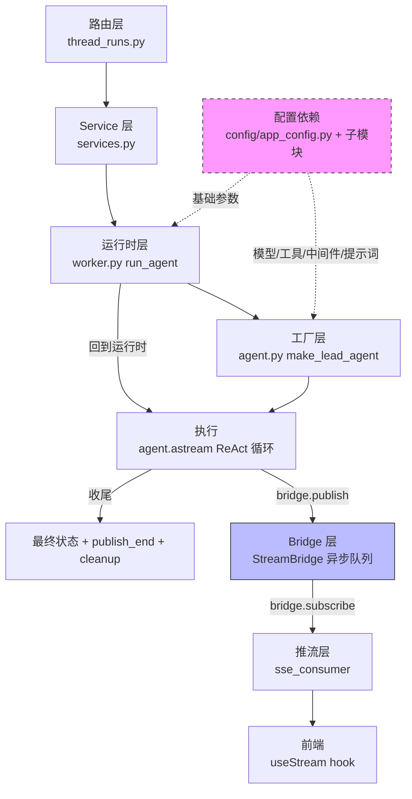

deer-flow-main\backend\app\gateway\ 整体架构

从用户请求到 agent 执行完毕的完整流程，按模块分层梳理

---

**一、路由层**

文件：`backend/app/gateway/routers/thread_runs.py`

职责：接收 HTTP 请求，解析参数，调度到 service 层，返回响应

``` python
@router.post("/{thread_id}/runs/stream")
async def stream_run(thread_id, body: RunCreateRequest, request: Request):
    bridge = get_stream_bridge(request)
    run_mgr = get_run_manager(request)
    record = await start_run(body, thread_id, request)
    return StreamingResponse(sse_consumer(bridge, record, request, run_mgr), ...)
```

路由层只做三件事：获取全局单例、调用 service、构建 StreamingResponse。不包含任何业务逻辑

---

**二、发布订阅模式（StreamBridge）**

文件：`backend/packages/harness/deerflow/runtime/stream_bridge/base.py`

职责：解耦 agent 执行（生产者）和 SSE 推流（消费者）

```
生产者：agent.astream() → serialize() → bridge.publish()
                     ↕ 异步队列
消费者：bridge.subscribe() → sse_consumer() → format_sse() → StreamingResponse → 前端
```

- `bridge.publish(run_id, event, data)` — agent 执行过程中将事件推入队列
- `bridge.subscribe(run_id)` — sse_consumer 异步迭代取出事件
- `bridge.publish_end(run_id)` — 发送结束哨兵，消费者关闭流
- `bridge.cleanup(run_id, delay)` — 延迟释放队列资源

生产者和消费者在不同协程中运行，互不阻塞。agent 执行速度和前端消费速度独立

---

**三、Service 层**

文件：`backend/app/gateway/services.py`

职责：编排整个 run 生命周期，连接路由层和运行时

`start_run()` 做的事：
1. 获取全局单例（bridge、run_mgr、checkpointer、store）
2. 解析断连行为（cancel / continue）
3. 创建 RunRecord（含冲突检测和策略校验）
4. 确保 thread 在 store 中可见
5. 准备运行参数（agent_factory 引用、graph_input、config、stream_modes）
6. 创建后台 task 执行 `run_agent()`
7. 启动标题同步任务
8. 返回 record

`run_agent()` 做的事：
1. 标记运行中 + 记录回滚检查点
2. 发布 metadata 事件
3. Runtime 注入 + 调用 agent_factory 创建 agent
4. 映射 stream_mode
5. **agent.astream() 执行核心循环**（bridge.publish 推流）
6. 设置最终状态（success / interrupted / error）
7. 发布 end 哨兵 + 清理

Service 层是整个流程的编排中心，协调路由层、配置系统、运行时、发布订阅各模块

---

**四、工厂模式创建 Agent**

文件：`backend/packages/harness/deerflow/agents/lead_agent/agent.py`

职责：根据参数和配置动态组装 agent

`make_lead_agent(config)` 组装五个传参给 `create_agent()`：

| 传参 | 来源 | 具体做什么 |
|------|------|-----------|
| `model` | config.yaml + body 参数 | `create_chat_model()` 反射创建 LLM 实例 |
| `tools` | config.yaml + MCP + 内置 + 社区 | `get_available_tools()` 从多源组装工具集 |
| `middleware` | config.yaml + body 参数 | `_build_middlewares()` 按配置构建有序中间件链 |
| `system_prompt` | config.yaml + skills + memory | `apply_prompt_template()` 动态生成系统提示词 |
| `state_schema` | 固定 | `ThreadState` 扩展线程级状态字段 |

工厂的输入是合并后的 config（body 运行时参数 + config.yaml 静态配置），输出是编译好的 LangGraph 状态图

---

**五、配置分散在各模块**

配置不是集中在一个文件处理，而是分散到各自的配置模块中：

| 配置模块 | 文件 | 管理内容 |
|----------|------|----------|
| `app_config.py` | 全局配置入口 | 模型列表、工具列表、沙箱、token_usage 等 |
| `model_config.py` | 模型配置 | provider 类路径、thinking/vision 支持、参数 |
| `agents_config.py` | 智能体配置 | 自定义智能体的模型名、工具组 |
| `summarization_config.py` | 摘要配置 | 触发条件、保留策略、摘要模型 |
| `memory_config.py` | 记忆配置 | 存储路径、去抖时间、事实阈值 |
| `extensions_config.py` | 扩展配置 | MCP servers 和 skills 启用状态 |
| `tool_search_config.py` | 工具搜索配置 | 延迟加载开关 |
| `guardrails_config.py` | 防护配置 | 工具调用授权策略 |
| `checkpointer_config.py` | 检查点配置 | 状态持久化方式 |
| `stream_bridge_config.py` | 流桥配置 | 队列参数 |

`get_app_config()` 在 `from_file()` 中按 key 分发到各子模块的 `load_*_from_dict()`，各模块独立缓存、独立访问。模型配置通过 `app_config.get_model_config(name)` 获取，其他模块通过各自的 `get_*_config()` 函数获取

---

**六、运行时层（run_agent）**

文件：`backend/packages/harness/deerflow/runtime/runs/worker.py`

职责：agent 执行的编排器，连接工厂模式和执行核心

`run_agent()` 做的事：
1. Runtime 注入（thread context + store 塞入 config）
2. 调用 `agent_factory(config)` → 触发 `make_lead_agent` 创建 agent（第五节）
3. 映射 stream_mode（前端协议名 → LangGraph 原生模式）
4. `agent.astream()` 执行核心循环，每轮 bridge.publish 推流
5. 取消检测（`abort_event`）、异常捕获、最终状态设置
6. `bridge.publish_end()` + `bridge.cleanup()` 清理收尾

运行时层本身不包含业务逻辑，是执行编排——组装好 agent 和参数后交给 LangGraph 的 `astream` 去跑，自己只管取消检测、序列化、推流、状态管理这些外围工作

---

**七、执行与收尾**

`agent.astream()` 执行的是 LangGraph 编译图内部的 ReAct 循环：

```
LLM 调用 → 检查是否需要工具 → 执行工具 → 结果返回 LLM → 再次调用 → ...
```

每步产出 chunk，经 serialize → bridge.publish 推入队列

执行结束后：
- 设置最终 RunStatus（success / interrupted / error）
- `bridge.publish_end()` 通知消费者流结束
- `bridge.cleanup(delay=60)` 延迟清理队列
- sse_consumer 收到 end 哨兵后关闭流
- 前端 useStream hook 收到最后一个 SSE 帧后更新 UI

运行时任务结束 → 推流结束 → 一轮 agent 执行完成

---

**七层架构总结**

| 层 | 文件 | 职责 |
|----|------|------|
| 路由层 | `app/gateway/routers/thread_runs.py` | 接收请求，获取全局单例，调度 service，返回响应 |
| Service 层 | `app/gateway/services.py` | 编排 run 生命周期，创建 Record，准备参数，启动后台 task |
| 运行时层 | `deerflow/runtime/runs/worker.py` | 执行编排：Runtime 注入、stream_mode 映射、调用工厂、agent.astream 循环、取消/异常/状态管理、清理 |
| 工厂层 | `deerflow/agents/lead_agent/agent.py` | 合并 body 参数 + config.yaml，动态组装 model/tools/middleware/prompt，create_agent 产出编译图 |
| 配置依赖 | `deerflow/config/app_config.py` + 子模块 | 全局配置加载、环境变量解析、子模块分散缓存，被运行时层和工厂层横向依赖 |
| Bridge 层 | `deerflow/runtime/stream_bridge/` | 生产消费解耦的异步队列，agent 执行推入，sse_consumer 取出 |
| 推流层 | `services.py` 的 `sse_consumer` | 消费 bridge 队列、format_sse 格式化、StreamingResponse 推前端 |

**文字版流程**

```
路由层 → Service 层 → 运行时层 → 工厂层 → 执行（agent.astream）
                       │                        │
                       │             bridge.publish（生产）
                       │                        ↓
                       │                   Bridge 层（异步队列）
                       │                        ↓
                       └── 推流层 sse_consumer ←─┘ → 前端

配置依赖：被运行时层和工厂层横向依赖
  运行时层 ← 取基础参数（单例、checkpointer、store）
  工厂层   ← 取模型/工具/中间件/提示词定义
```

**Mermaid 版**



> 本文档：整个流程分七层——路由层接请求、Service 层编排生命周期、运行时层编排 agent 执行、工厂层动态创建 agent、配置层横向依赖、Bridge 层生产消费解耦、推流层 SSE 推前端。配置不是纵向链路的一环，而是被运行时层和工厂层依赖的横向模块
