# 核心流程：从一条消息到多智能体协作

## 一句话本质

DeerFlow 的核心是一个 **"请求 → 构建 → 流式执行 → 事件推送"** 的管道。用户消息进入 Gateway API，触发 Agent 工厂按需构建一个带中间件链和工具集的 LangGraph 编译图，然后在一个 asyncio 协程中流式执行，通过 StreamBridge（asyncio.Queue）解耦生产和消费，SSE 推回前端。当任务复杂时，Lead Agent 通过 `task` 工具将子任务委派给 SubagentExecutor，在独立线程池中并发运行多个子智能体。

---

## 模块地图

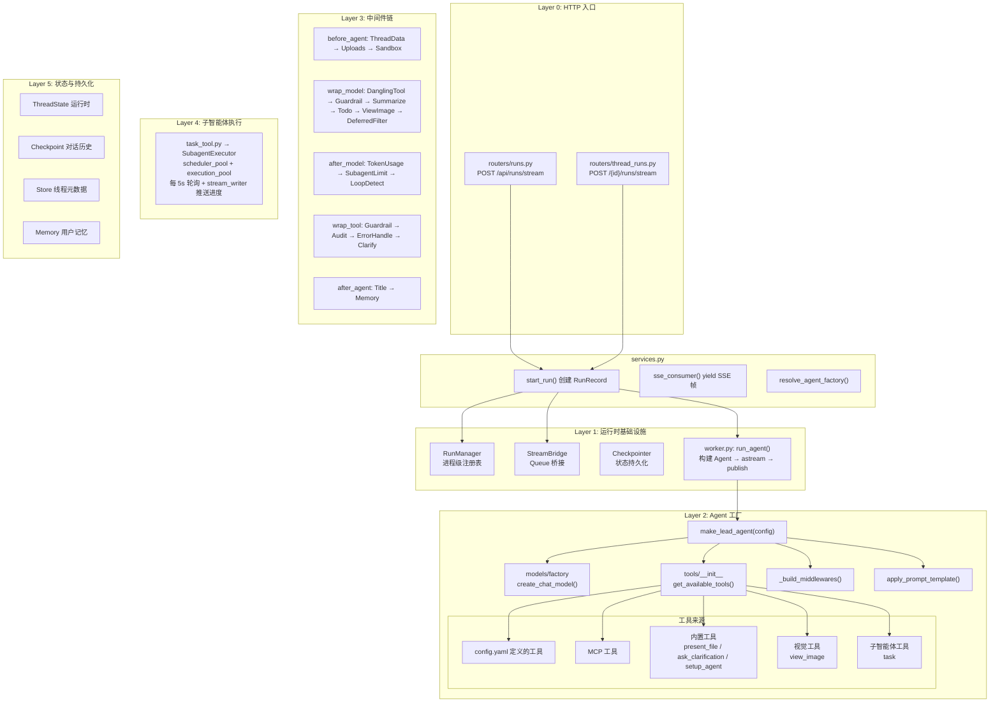

---

## 请求路径跟踪：用户发一条消息到收到回答

下面以最常用的 `POST /api/runs/stream` 为例，逐层跟踪一个完整请求的旅程。

### 第 0 层：依赖初始化（应用启动时，一次性）

**文件**: `app/gateway/deps.py` → `app/gateway/app.py`

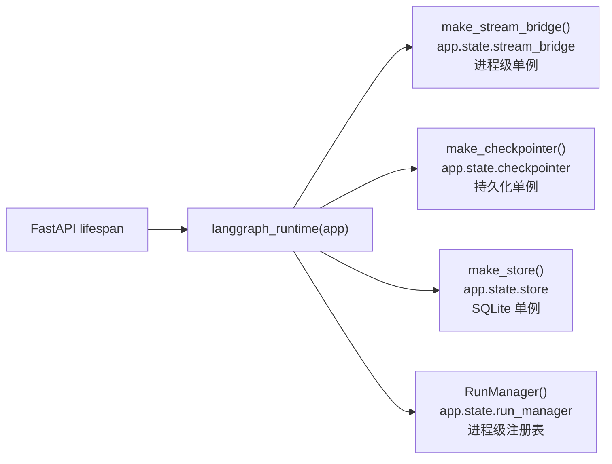

四个单例通过 `request.app.state` 在请求间共享。`deps.py` 中的 `get_xxx(request)` 函数负责提取，路由层调用它们获取依赖。

### 第 1 层：HTTP 入口

**文件**: `routers/runs.py:34`

```python
@router.post("/stream")
async def stateless_stream(body: RunCreateRequest, request: Request):
    thread_id = _resolve_thread_id(body)           # 从 body.config 取，或生成 UUID
    bridge = get_stream_bridge(request)             # 从 app.state 取单例
    run_mgr = get_run_manager(request)              # 从 app.state 取单例
    record = await start_run(body, thread_id, request)  # 启动运行
    return StreamingResponse(
        sse_consumer(bridge, record, request, run_mgr), # SSE 消费者
        media_type="text/event-stream",
    )
```

**路由层只做三件事**：解析 thread_id、启动运行、返回 SSE 流。业务逻辑全部委托给 `services.py`。

### 第 2 层：运行生命周期（start_run）

**文件**: `services.py:190-263`

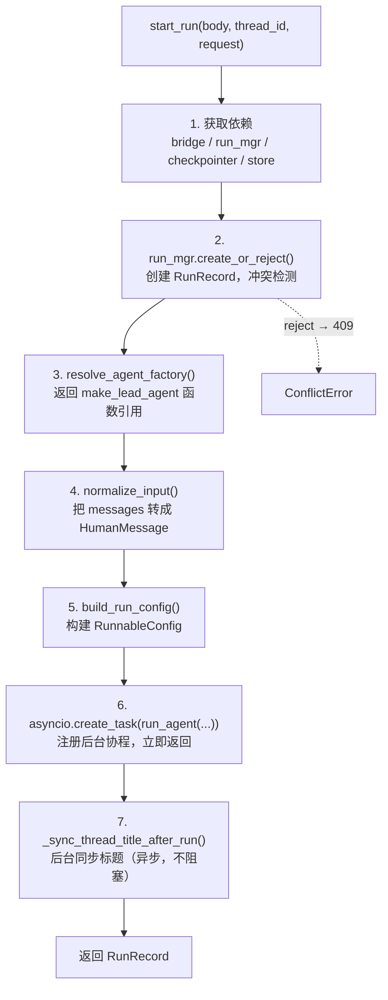

**关键设计**：`asyncio.create_task` 把 `run_agent` 注册到事件循环但不立即执行。此时同一个循环上挂着两个协程——`run_agent`（等调度）和 `sse_consumer`（等队列数据）——它们通过 asyncio.Queue 解耦。

### 第 3 层：Agent 执行（run_agent）

**文件**: `packages/harness/deerflow/runtime/runs/worker.py:26`

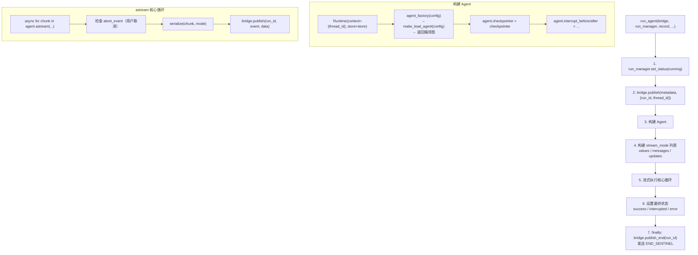

**步骤 3 中 `agent_factory(config)` 触发完整的 Agent 构建**——这是最关键的一步，下面展开。

### 第 4 层：Agent 工厂（make_lead_agent）

**文件**: `packages/harness/deerflow/agents/lead_agent/agent.py:274`

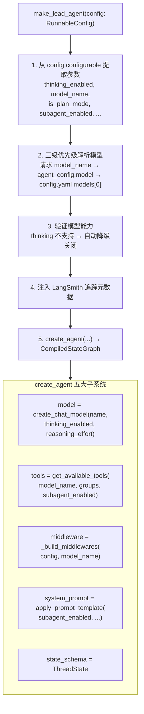

五个子系统的组装：

#### 4.1 模型工厂（create_chat_model）

**文件**: `packages/harness/deerflow/models/factory.py`

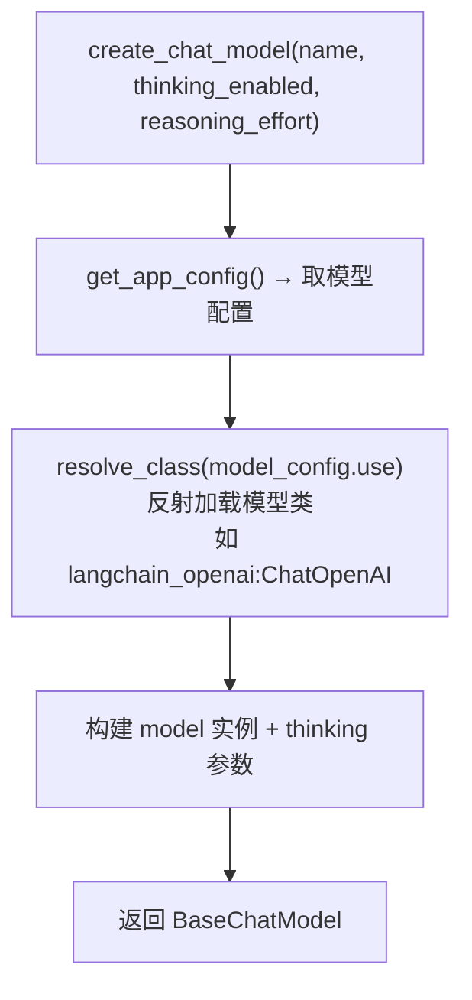

#### 4.2 工具组装（get_available_tools）

**文件**: `packages/harness/deerflow/tools/__init__.py`

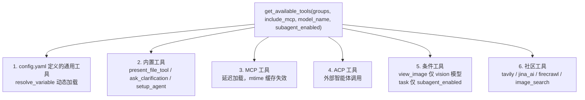

#### 4.3 中间件链（_build_middlewares）

**文件**: `agent.py:209-271`

中间件按严格顺序组装，执行时依次经过。顺序不可随意调整，因为后续中间件依赖前置中间件设置的状态：

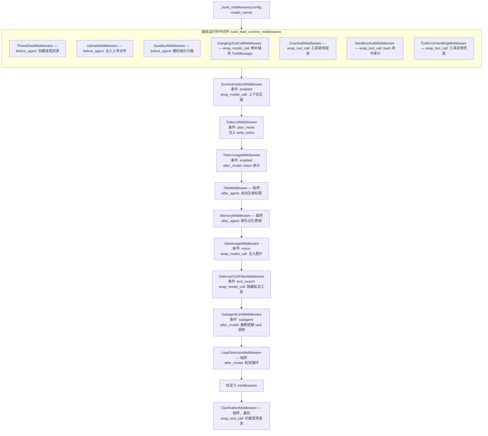

#### 4.4 系统提示（apply_prompt_template）

**文件**: `packages/harness/deerflow/agents/lead_agent/prompt.py`

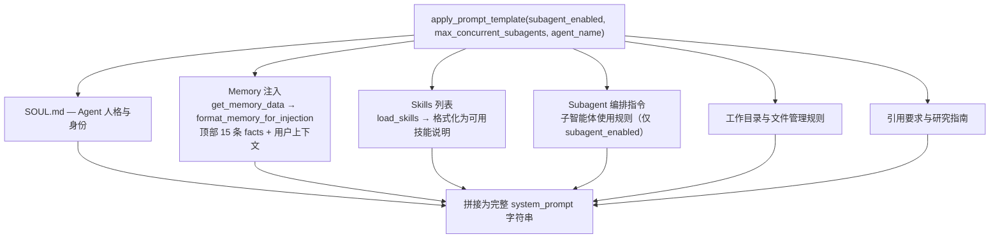

#### 4.5 状态模式（ThreadState）

**文件**: `packages/harness/deerflow/agents/thread_state.py`

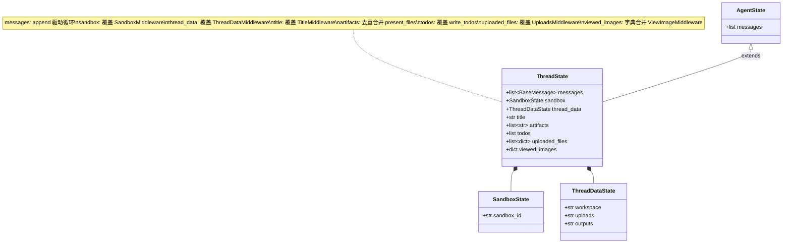

### 第 5 层：Agent Loop 执行

Agent 构建完成后，回到 `worker.py` 的 `agent.astream(graph_input, config, stream_mode)` 进入执行循环：

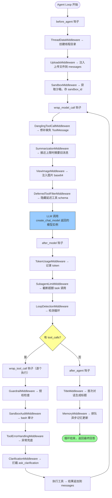

`messages` 列表驱动循环：LLM 输出追加到 messages，工具回复追加到 messages，直到 LLM 不再输出 `tool_calls`。

---

## 子智能体协作全流程

当一个复杂任务需要多智能体协作时，Lead Agent 调用 `task` 工具委派子任务。

### 触发条件

Lead Agent 在 `after_model` 阶段输出 `tool_calls` 包含 `task` 工具调用。`SubagentLimitMiddleware` 确保不超过 `max_concurrent_subagents`（默认 3）。

### 完整协作链路

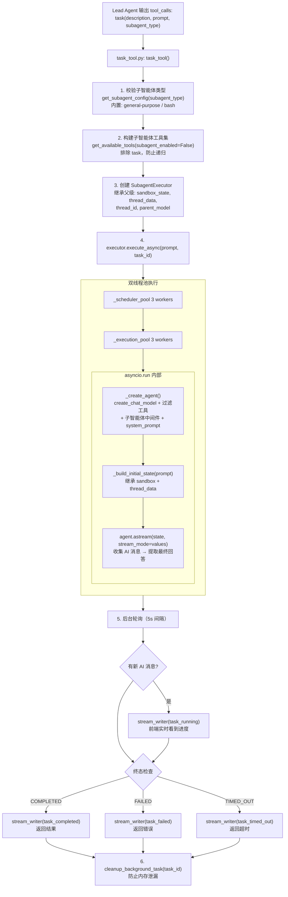

### 并发子智能体架构

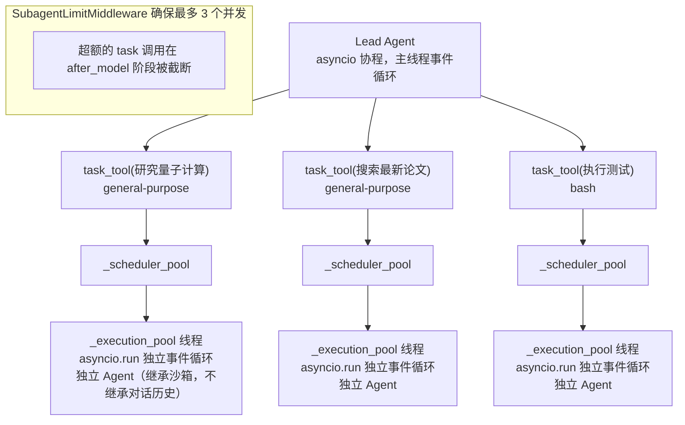

**关键设计**：
- 子智能体在独立线程池中运行（`ThreadPoolExecutor`），与 Lead Agent 的 asyncio 事件循环隔离
- 子智能体通过 `asyncio.run()` 创建自己的事件循环，可以执行异步工具（MCP 工具等）
- 沙箱和线程目录从父级继承，保证文件系统路径一致
- `task_tool` 在 Lead Agent 协程中以 5 秒间隔轮询结果，同时通过 `stream_writer` 推送进度
- 双线程池架构：`_scheduler_pool`（3 workers）负责任务编排，`_execution_pool`（3 workers）负责实际执行

---

## 完整时序图：从一条消息到多智能体协作

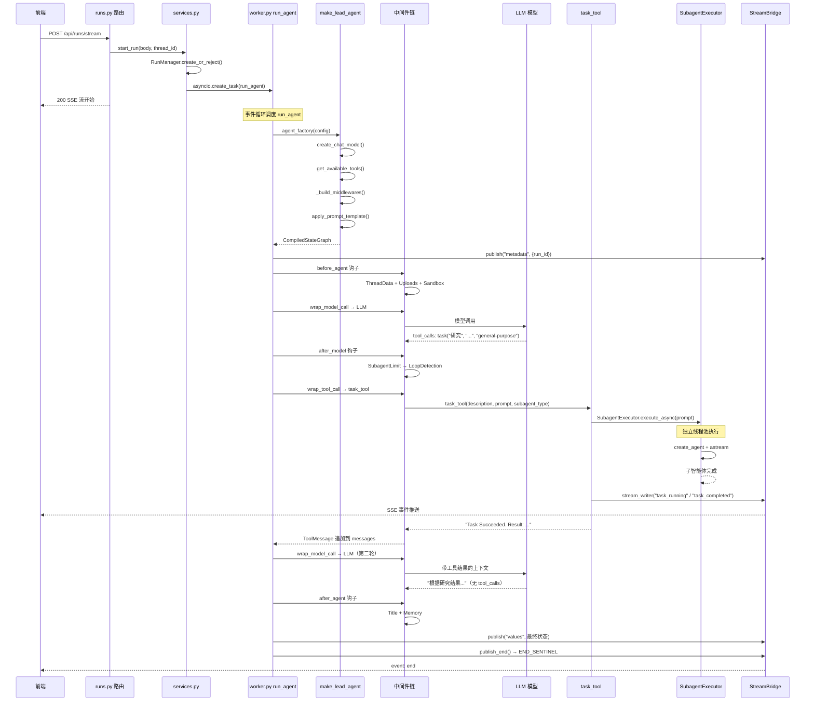

---

## 沙箱与文件系统隔离

每个线程拥有独立的文件目录，Agent 看到的是虚拟路径：

| Agent 视角（虚拟路径） | 物理路径 |
| - | - |
| `/mnt/user-data/workspace/` | `.deer-flow/threads/{thread_id}/user-data/workspace/` |
| `/mnt/user-data/uploads/` | `.deer-flow/threads/{thread_id}/user-data/uploads/` |
| `/mnt/user-data/outputs/` | `.deer-flow/threads/{thread_id}/user-data/outputs/` |
| `/mnt/skills/` | `deer-flow/skills/` |
| `/mnt/acp-workspace/` | `.deer-flow/threads/{thread_id}/acp-workspace/` |

Sandbox 工具（bash / read_file / write_file / ls / str_replace）通过 `replace_virtual_path()` 在执行时翻译路径。`mask_local_paths_in_output()` 确保输出中不泄露宿主机物理路径。

---

## 状态持久化层次

| 组件 | 存储 | 生命周期 | 内容 |
|------|------|---------|------|
| `StreamBridge` | asyncio.Queue（内存） | 进程重启丢失 | SSE 事件流 |
| `RunManager` | dict（内存） | 进程重启丢失 | 运行状态注册表 |
| `Checkpointer` | 磁盘/SQLite | 持久 | 完整对话历史（messages + 所有 ThreadState 字段） |
| `Store` | SQLite | 持久 | 线程元数据（标题、创建时间） |
| `Memory` | memory.json | 持久 | 用户画像、事实、历史上下文 |

---

## 关键设计决策总结

| 设计 | 原因 |
|------|------|
| StreamBridge 解耦生产消费 | Agent 执行不被网络推送阻塞，SSE 推送不被 Agent 阻塞 |
| 每次请求构建新 Agent | 支持运行时参数切换（模型、工具、中间件），无需预热 |
| 子智能体在独立线程池 | 与主事件循环隔离，避免阻塞其他请求的 SSE 推送 |
| task_tool 轮询 + stream_writer | Lead Agent 不需要额外查询接口，前端通过同一 SSE 流接收子智能体进度 |
| 双线程池（scheduler + execution） | 调度编排与实际执行分离，避免调度器阻塞 |
| 中间件严格顺序 | 后续中间件依赖前置中间件设置的状态（如 SandboxMiddleware 设置 sandbox_id 后工具才能使用沙箱） |
| 虚拟路径系统 | Agent 看到一致的路径，不感知宿主机物理路径差异 |
