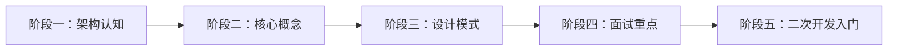

# DeerFlow 架构学习路径计划
## 目标：初学者学架构 + 面试准备

---

## 一、学习路径总览



**设计考量**：从整体到局部，从概念到实现，符合人类认知规律。

---

## 阶段一：架构认知（建立全局视野）

### 📄 文档08：DeerFlow是什么——五分钟看懂AI Agent框架

**你要学到**：
- DeerFlow解决了什么问题？（AI工作流编排的行业痛点）
- 它的核心能力是什么？（子代理、记忆、沙箱、技能）
- 它和其他框架有什么不同？（差异化优势）

**内容形式**：
- 一张核心架构图
- 一个完整业务流程示例
- 关键概念词汇表

**面试要点**：
```
Q: 什么是AI Agent框架？
A: AI Agent框架是用于编排大模型、工具和记忆的系统...
Q: DeerFlow的核心优势？
A: 原生支持子代理编排、内置长期记忆、双模式沙箱...
```

---

### 📄 文档09：系统架构全景图——各层如何协作

**你要学到**：
- 系统分几层？每层干什么？（用户交互层→核心引擎层→能力扩展层→集成服务层）
- 为什么要分层？（解耦、可扩展、便于维护）
- 请求从进入到响应的完整链路

**内容形式**：
- 分层架构图（带颜色区分）
- 请求流程时序图
- 每层的职责说明（不用代码）

**设计思路解读**：
```
为什么这样分层？
→ 前端可以独立替换
→ 后端引擎可以单独使用
→ 集成服务可以灵活扩展
```

**面试要点**：
```
Q: 系统为什么要这样分层？
Q: 如果要支持新的IM渠道，需要改动哪些层？
```

---

## 阶段二：核心概念深入（理解关键机制）

### 📄 文档10：代理系统——Agent到底是什么

**你要学到**：
- Agent vs 传统程序的区别（自主决策 vs 按指令执行）
- Lead Agent（主导代理）的角色（指挥官）
- Sub-Agent（子代理）为什么需要（专业分工）
- 代理之间如何协作

**内容形式**：
- 代理协作流程图
- 一个具体任务如何分解的例子
- 核心概念对照表

**设计思路**：
```
为什么要子代理？
→ 单个Agent难以同时擅长搜索、编程、写作
→ 子代理可以专业分工，各自最优
→ 主导代理负责协调，类似项目经理
```

**面试要点**：
```
Q: Agent和传统API调用有什么区别？
Q: 什么时候需要用子代理？
Q: 如何避免子代理无限创建？
```

---

### 📄 文档11：记忆系统——AI如何"记住"对话

**你要学到**：
- 长期记忆 vs 短期记忆
- 向量存储是什么（用大白话讲）
- 记忆如何检索（相关度匹配）
- 为什么需要记忆系统

**内容形式**：
- 记忆存储结构图
- 记忆检索流程图
- 记忆 vs 数据库 vs 缓存的区别

**设计思路**：
```
为什么需要向量存储？
→ 语义搜索比关键词搜索更智能
→ "用户喜欢苹果"和"用户爱吃水果"能匹配上
→ 支持跨会话的知识积累
```

**面试要点**：
```
Q: AI的记忆和数据库存储有什么区别？
Q: 什么是向量数据库？为什么要用？
Q: 如何管理记忆的容量和过期？
```

---

### 📄 文档12：中间件系统——请求处理的"流水线"

**你要学到**：
- 中间件是什么（每一步处理什么）
- 中间件的执行顺序（为什么不能乱）
- 每个中间件的作用（数据→沙箱→错误→记忆→标题...）

**内容形式**：
- 中间件链路图（管道模型）
- 每个中间件的输入输出
- 一个请求经过所有中间件的完整流程

**设计思路**：
```
为什么用中间件模式？
→ 职责单一，每个中间件只做一件事
→ 可灵活插拔，需要就加，不需要就删
→ 顺序可配置，适应不同场景
```

**面试要点**：
```
Q: 中间件和普通函数调用有什么区别？
Q: 中间件的执行顺序为什么重要？
Q: 如何添加自定义中间件？
```

---

### 📄 文档13：工具与技能——Agent的"手"和"技能包"

**你要学到**：
- Tool（工具）是什么（Agent能调用的函数）
- Skill（技能）是什么（多个工具组合的完整能力）
- 工具注册机制
- 技能加载机制

**内容形式**：
- 工具调用流程图
- 技能包结构示意图
- 常见工具/技能列表

**设计思路**：
```
为什么要区分Tool和Skill？
→ Tool是原子能力（如：搜索、计算）
→ Skill是完整解决方案（如：深度研究 = 搜索+整理+报告）
→ Skill可以复用和分享
```

**面试要点**：
```
Q: Tool和Skill的区别？
Q: Agent如何知道该调用哪个工具？
Q: 如何让Agent支持新的工具？
```

---

### 📄 文档14：沙箱系统——安全执行不可信代码

**你要学到**：
- 为什么需要沙箱（AI生成的代码可能有害）
- 本地沙箱 vs Docker沙箱
- 沙箱的隔离机制

**内容形式**：
- 沙箱架构对比图
- 安全威胁场景示意
- 沙箱执行流程

**设计思路**：
```
为什么需要沙箱？
→ AI生成的代码质量不可控
→ 可能删除文件、泄露数据、死循环
→ 沙箱提供隔离环境，出问题不影响主系统
```

**面试要点**：
```
Q: 为什么要用沙箱执行AI生成的代码？
Q: 本地沙箱和Docker沙箱有什么区别？
Q: 沙箱能完全保证安全吗？
```

---

### 📄 文档15：检查点与状态管理——如何实现"暂停/恢复"

**你要学到**：
- 什么是检查点（执行状态的快照）
- 为什么要检查点（长时间任务可以中断恢复）
- 状态存储的选型（SQLite vs PostgreSQL）

**内容形式**：
- 检查点存储结构图
- 暂停/恢复流程图
- 状态演变示意图

**设计思路**：
```
为什么需要检查点？
→ AI任务可能执行很久（几十分钟）
→ 用户可能主动暂停
→ 系统可能崩溃，需要能恢复
→ 检查点就像游戏的存档点
```

**面试要点**：
```
Q: 什么场景需要检查点机制？
Q: 检查点存储了哪些信息？
Q: 如何实现检查点的恢复？
```

---

## 阶段三：设计模式提炼（工程思想）

### 📄 文档16：DeerFlow用到的设计模式

**你要学到**：
- 工厂模式：代理工厂
- 中间件模式：请求处理链
- 策略模式：多模型适配
- 观察者模式：流式响应
- 适配器模式：多模型/多工具适配

**内容形式**：
- 每个模式的示意图
- 在DeerFlow中的应用场景
- 为什么用这个模式

**面试要点**：
```
Q: DeerFlow用了哪些设计模式？
Q: 为什么代理创建用工厂模式？
Q: 中间件模式的好处是什么？
```

---

### 📄 文档17：架构设计权衡（没有完美的架构）

**你要学到**：
- 灵活性 vs 复杂性
- 性能 vs 可扩展性
- 一致性 vs 最终一致性
- DeerFlow做了哪些取舍

**内容形式**：
- 权衡对比表
- 具体场景的分析

**设计思路**：
```
为什么选择LangGraph？
→ 强大的状态图编排能力
→ 但学习曲线陡峭
→ 权衡：功能 > 易用性
```

**面试要点**：
```
Q: 如果让你重新设计，你会做哪些不同的选择？
Q: DeerFlow的架构有什么缺点？
Q: 什么场景不适合用DeerFlow？
```

---

## 阶段四：面试常问问题

### 📄 文档18：面试高频问题清单

**架构类**：
- DeerFlow的整体架构是什么？
- 各层之间如何通信？
- 如何保证系统的可扩展性？

**机制类**：
- Agent的决策流程是什么？
- 工具调用如何实现？
- 记忆系统如何工作？

**设计类**：
- 为什么要用状态图（LangGraph）？
- 中间件模式的优势？
- 如何处理Agent的无限循环？

**场景类**：
- 如何支持新的LLM模型？
- 如何添加自定义工具？
- 如何实现多租户隔离？

---

## 阶段五：二次开发入门

### 📄 文档19：扩展点在哪里

**你要学到**：
- 自定义模型适配器
- 自定义工具
- 自定义技能
- 自定义中间件
- 自定义渠道

**内容形式**：
- 扩展点地图
- 每个扩展点的开发难度
- 快速开始指南

---

### 📄 文档20：从0到1创建自定义技能

**实战导向**：
- 技能包结构
- 技能定义文件
- 如何测试技能
- 如何分享技能

---

## 学习路径说明

### 建议学习顺序

```
第1天：文档08-09（建立全局认知）
第2天：文档10-12（核心概念）
第3天：文档13-15（核心机制）
第4天：文档16-17（设计思想）
第5天：文档18（面试准备）
实战：文档19-20（动手实践）
```

### 每篇文档的标准结构

1. **5分钟速览**：这篇讲什么，解决什么问题
2. **核心概念**：关键词解释（无代码）
3. **架构/流程图**：可视化展示
4. **设计思路**：为什么这样做
5. **面试要点**：可能被问什么
6. **延伸思考**：这个设计的优缺点

### 与原计划的区别

| 对比项 | 原计划 | 新计划 |
|--------|--------|--------|
| 目标读者 | 源码阅读者 | 架构学习者+面试者 |
| 内容侧重 | 代码逐行解析 | 设计思想+流程概念 |
| 文档数量 | 44篇全覆盖 | 20篇精炼 |
| 代码占比 | 高 | 无/极少 |
| 学习路径 | 按目录拆分 | 按认知递进 |

---

**下一步**：您觉得这个路径如何？需要调整吗？确认后我开始生成文档08。
