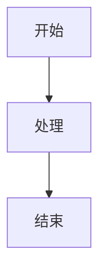

# DeerFlow 源码分析 - 质量约束文档

## 📋 文档说明

本文档定义了 DeerFlow 后端源码分析过程中必须遵守的质量约束、格式约束和安全约束。

## 1️⃣ 质量约束

### 1.1 设计思路占比

**约束**：每篇文档中"设计思想解读"模块必须占比 ≥ 20%

**检测方法**：
- 统计"设计思想解读"模块的字数
- 统计文档总字数
- 计算占比：`设计思想字数 / 总字数 ≥ 0.2`

**不满足后果**：文档不合格，需重写

### 1.2 源码覆盖率

**约束**：每个 `.py` 文件必须被阅读和分析

**要求**：
- 即使是 `__init__.py` 也要说明设计意图
- 不能跳过任何文件
- 文件清单必须完整

### 1.3 文件路径标注

**约束**：所有源码片段必须标注【文件绝对路径】

**格式**：
```
文件路径：/data/deer-flow-main/backend/packages/harness/deerflow/xxx/yyy.py
```

### 1.4 Mermaid 图表

**约束**：每篇文档必须包含至少 1 个 Mermaid 图表

**要求**：
- 图表必须可直接渲染
- 图表下方必须有"设计解读"
- 解读要说明"为什么采用这样的结构"

### 1.5 逐行解读

**约束**：核心源码必须逐行解读

**要求**：
- 不只是翻译代码，要讲"为什么这么写"
- 说明设计考量、权衡取舍
- 对比其他可行方案

## 2️⃣ 格式约束

### 2.1 文档结构

每篇文档必须遵循以下结构：

```markdown
# 【编号】模块名深度解析

## 1. 模块全局定位
## 2. 核心设计理念
## 3. 架构原理图
## 4. 核心源码解析
## 5. 设计思想解读（占比≥20%）
## 6. 可复用代码片段
## 7. 踩坑提醒与优化建议
## 8. 相关模块索引
## 9. 参考资料链接
```

### 2.2 标题层级

- 一级标题 `#`：仅用于文档标题
- 二级标题 `##`：文档章节
- 三级标题 `###`：章节子节
- 四级标题 `####`：细节说明

### 2.3 代码块格式

```python
# 文件路径：/xxx/xxx.py
# 行号范围：行123-行456

def function_name(param: type) -> return_type:
    """功能概述"""
    # 逐行解读
    pass
```

### 2.4 Mermaid 格式



### 2.5 链接格式

- 模块间引用：`与 02-代理系统 的关系`
- 源码引用：`文件路径：/xxx/xxx.py`
- 外部文档：`[文档名](https://example.com)`

## 3️⃣ 内容约束

### 3.1 设计思路重点

每篇文档必须回答：

1. **为什么这样设计？**（设计动机）
2. **为什么不用其他方案？**（设计取舍）
3. **这么写的好处是什么？**（设计优势）
4. **不这么写会有什么问题？**（设计风险）

### 3.2 术语解释

- 陌生技术名词必须附带通俗解释
- 英文注释、变量名需要说明含义
- 首次出现的缩写需要展开

### 3.3 对比分析

- 对比不同实现方案的优缺点
- 说明为什么选择当前方案
- 分析替代方案的适用场景

### 3.4 实战导向

- 必须包含"可复用代码片段"
- 必须包含"踩坑提醒"
- 必须包含"二次开发建议"

## 4️⃣ 安全约束

### 4.1 敏感信息

**禁止**在文档中泄露：
- API 密钥
- 数据库密码
- 内网 IP 地址
- 用户隐私数据

### 4.2 代码安全

分析时必须指出：
- SQL 注入风险
- XSS 漏洞
- 命令注入风险
- 路径穿越漏洞

### 4.3 依赖安全

分析时必须说明：
- 第三方库的版本要求
- 已知的安全漏洞
- 依赖更新的建议

## 5️⃣ 语言约束

### 5.1 书写语言

- 使用简体中文
- 专业术语可保留英文
- 代码注释保留原文

### 5.2 语气风格

- 客观、准确、专业
- 避免主观臆断
- 使用"建议"、"可能"、"通常"等词语

### 5.3 格式规范

- 标点符号：中文内容使用中文标点
- 数字与单位：数字与单位间空一格（如 100 MB）
- 专有名词：保持首字母大写

## 6️⃣ 质量检查清单

生成文档后，使用以下清单检查：

- [ ] 设计思想占比 ≥ 20%
- [ ] 包含 Mermaid 图表
- [ ] 图表有设计解读
- [ ] 所有源码标注文件路径
- [ ] 每个 `.py` 文件都被分析
- [ ] 包含"为什么这样设计"
- [ ] 包含可复用代码片段
- [ ] 包含踩坑提醒
- [ ] 包含相关模块索引
- [ ] 无敏感信息泄露
- [ ] 术语有解释
- [ ] 代码有逐行解读

## 7️⃣ 不合格处理

### 7.1 质量不达标

**问题**：设计思想占比 < 20%

**处理**：重写"设计思想解读"模块，增加深度分析

### 7.2 缺少图表

**问题**：文档缺少 Mermaid 图表

**处理**：补充架构图、流程图或时序图

### 7.3 源码分析不足

**问题**：只翻译代码，不讲设计

**处理**：重写源码解析部分，增加"为什么"

### 7.4 覆盖不全

**问题**：遗漏某些文件

**处理**：补充遗漏文件的分析

## 8️⃣ 审核流程

1. **自检**：使用质量检查清单
2. **交叉审核**：其他模块作者审核
3. **最终审核**：项目负责人审核

---

**约束版本**：v1.0
**生效日期**：2026-04-01
**维护者**：DeerFlow 文档团队
