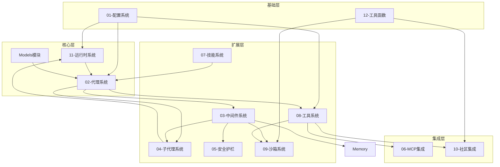

# DeerFlow 模块依赖关系文档

## 📋 依赖总览图



## 📊 模块依赖矩阵

| 模块 | 依赖模块 | 被依赖模块 | 依赖强度 |
|------|----------|------------|----------|
| 01-配置系统 | - | 所有模块 | ⭐⭐⭐⭐⭐ |
| 02-代理系统 | 配置、运行时、模型 | 中间件、子代理 | ⭐⭐⭐⭐⭐ |
| 03-中间件系统 | 配置、代理、护栏 | - | ⭐⭐⭐⭐ |
| 04-子代理系统 | 配置、运行时 | 中间件 | ⭐⭐⭐⭐ |
| 05-安全护栏 | 配置 | 中间件、工具 | ⭐⭐⭐ |
| 06-MCP集成 | 配置、工具函数 | 工具 | ⭐⭐⭐ |
| 07-技能系统 | 配置、工具函数 | 代理 | ⭐⭐⭐ |
| 08-工具系统 | 配置、沙箱 | 代理、中间件 | ⭐⭐⭐⭐ |
| 09-沙箱系统 | 配置、工具函数 | 工具、社区 | ⭐⭐⭐ |
| 10-社区集成 | 配置、工具函数 | 工具 | ⭐⭐ |
| 11-运行时系统 | 配置、工具函数 | 代理、子代理 | ⭐⭐⭐⭐⭐ |
| 12-工具函数 | - | 所有模块 | ⭐⭐⭐⭐ |
| Models模块 | 配置、工具函数 | 代理 | ⭐⭐⭐⭐⭐ |

## 🔍 依赖关系详解

### 1. 配置系统（01）

**被依赖原因**：
- 所有模块都需要读取配置
- 提供单例访问模式
- 支持热更新

**依赖类型**：
- 强依赖：所有模块初始化时都需要
- 无循环依赖

### 2. 代理系统（02）

**上游依赖**：
- 配置系统：读取代理配置
- 运行时系统：状态管理
- Models：LLM 调用

**下游依赖**：
- 中间件系统：横切逻辑
- 子代理系统：任务委派
- 工具系统：能力扩展

### 3. 中间件系统（03）

**上游依赖**：
- 配置系统：中间件配置
- 代理系统：执行上下文
- 安全护栏：权限检查

**下游依赖**：
- 无直接下游，作为代理的增强

### 4. 子代理系统（04）

**上游依赖**：
- 配置系统：子代理配置
- 运行时系统：子代理运行
- 代理系统：父代理

**下游依赖**：
- 中间件系统：子代理限制

### 5. 安全护栏（05）

**上游依赖**：
- 配置系统：护栏配置

**下游依赖**：
- 中间件系统：护栏中间件
- 工具系统：工具调用拦截

### 6. MCP集成（06）

**上游依赖**：
- 配置系统：MCP 配置
- 工具函数：HTTP 请求

**下游依赖**：
- 工具系统：MCP 工具注册

### 7. 技能系统（07）

**上游依赖**：
- 配置系统：技能目录配置
- 工具函数：文件解析

**下游依赖**：
- 代理系统：技能加载

### 8. 工具系统（08）

**上游依赖**：
- 配置系统：工具配置
- 沙箱系统：代码执行
- MCP集成：外部工具
- 社区集成：第三方工具

**下游依赖**：
- 代理系统：工具调用
- 中间件系统：工具拦截

### 9. 沙箱系统（09）

**上游依赖**：
- 配置系统：沙箱配置
- 工具函数：安全检查

**下游依赖**：
- 工具系统：代码执行工具
- 社区集成：AIO 沙箱

### 10. 社区集成（10）

**上游依赖**：
- 配置系统：API 配置
- 工具函数：网络请求

**下游依赖**：
- 工具系统：工具注册

### 11. 运行时系统（11）

**上游依赖**：
- 配置系统：运行时配置
- 工具函数：序列化

**下游依赖**：
- 代理系统：运行管理
- 子代理系统：子代理运行

### 12. 工具函数（12）

**特点**：
- 无上游依赖
- 被所有模块依赖
- 提供基础设施

## 🔄 循环依赖检查

**结论**：无循环依赖

所有模块依赖关系为 DAG（有向无环图），可以安全地按依赖顺序加载。

## 📐 推荐加载顺序

```python
# 第一层：无依赖模块
1. 12-工具函数
2. 01-配置系统

# 第二层：依赖第一层
3. 11-运行时系统
4. Models模块

# 第三层：依赖前两层
5. 02-代理系统
6. 09-沙箱系统
7. 07-技能系统

# 第四层：依赖前三层
8. 08-工具系统
9. 05-安全护栏
10. 06-MCP集成

# 第五层：依赖前四层
11. 10-社区集成
12. 03-中间件系统
13. 04-子代理系统
```

## 🔗 模块间通信方式

### 1. 直接导入

```python
# 代理系统导入配置
from deerflow.config import AppConfig
```

### 2. 依赖注入

```python
# 运行时注入存储提供者
class RunManager:
    def __init__(self, store: StoreProvider):
        self.store = store
```

### 3. 事件驱动

```python
# 流式桥接通过事件传递 chunk
await stream_bridge.publish(thread_id, chunk)
```

### 4. 注册表模式

```python
# 工具注册表
registry.register(tool)
```

## 🚨 依赖变更影响

### 高风险变更

以下模块变更影响范围最大：

1. **01-配置系统**：影响所有模块
2. **02-代理系统**：影响执行流程
3. **11-运行时系统**：影响状态管理

### 低风险变更

以下模块变更影响范围较小：

1. **10-社区集成**：仅影响工具注册
2. **12-工具函数**：纯函数，影响有限

## 📝 模块解耦建议

### 1. 接口抽象

- 使用抽象基类定义接口
- 通过依赖注入解耦具体实现

### 2. 事件驱动

- 使用事件总线解耦模块
- 异步通信降低耦合

### 3. 配置驱动

- 通过配置控制模块行为
- 避免硬编码依赖

---

**依赖版本**：v1.0
**生成时间**：2026-04-01
**基于**：DeerFlow Backend v1.0
